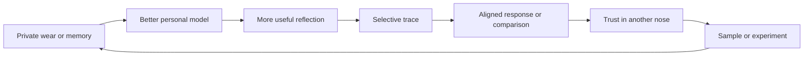

# nota. Customer, Competitor, and Acquisition Teardown

**Decision snapshot:** 16 July 2026  
**Scope:** Customer experience, personas, competitors, community, advertising, App Store readiness, and strategic acquisition value  
**Recommendation:** Build proof independently. A non-exclusive controlled partnership is one future option, subject to founder objectives and legal and commercial review. Do not offer acquisition rights, sell, or integrate nota. as a generic catalogue, social feed, or ad product.

## Pre-Launch Cut

**Added 2026-07-17.** The full teardown below is strategic; this section converts its most acute findings into pass/fail launch gates — things that must be true before nota. is shown to real users outside the founder. Status reflects the 2026-07-17 remediation pass; re-verify before shipping.

| Gate | Requirement | Status |
|---|---|---|
| Privacy accuracy | Privacy policy does not claim "no accounts" or "no server persistence" when Supabase Auth + server-stored data exist | **Fixed** — `app/(main)/privacy/page.tsx` rewritten 2026-07-17 to describe local/guest mode, signed-in server storage, consent-gated analytics, and the deletion contact accurately. |
| Traces reaction contract | Checked-in migrations reproduce the live `trace_reactions` schema | **Fixed** — live schema verified via Supabase MCP (`trace_id`/`user_id`/`reaction`, values `on_the_nose`/`feel_this`/`too_real`); idempotent migration `20260717_align_trace_reactions_contract.sql` added (not yet applied — needs approval). Legacy `anon_id`/`reaction_type` code in `app/(main)/insights/page.tsx` and `compute-insights-nightly` updated to match. `insights_cache` had the same drift (also fixed, migration `20260717_align_insights_cache_contract.sql`). |
| AI graceful failure | `/api/pros-cons` (and `/api/proscons`) do not 500 when Claude wraps JSON in a markdown fence | **Fixed** — responses are stripped before parsing; parse/call failures return a quiet `unavailable` state instead of a 500, and the UI shows an on-brand "isn't available right now" line instead of vanishing or a raw error. |
| Fit-language humility | No visible "Strong fit" claims without calibration evidence | **Fixed** — `lib/fitNarrative.ts` and `app/(main)/discover/DiscoverGrid.tsx` now show "Matches your pattern" instead of "Strong fit". Still not calibrated against outcomes — do not read the new label as validated confidence. |
| Post-Read next action | The reveal hands the user one concrete next step, not just a static result | **Fixed** — `app/noseprint/NoseprintClient.tsx` now shows "Add three fragrances you know, including one you stopped loving" linking to `/collection`, per §4's "first ten minutes" finding. |
| App Store story | The store screenshot sequence has an owned task list, not just prose | **Added** — see `docs/todo/app-store-launch-checklist.md`. |

Not yet gated (out of this pass's scope, still blocking per §16 Acceptance Gates): live `aura-advisory` 503s, catalogue/imagery rights ledger, RLS adversarial testing, D30 retention measurement, community moderation controls.

## 1. Executive Verdict

nota. has a differentiated brand and a credible product idea, but it is not yet an acquisition-ready community, advertising platform, or App Store leader.

The valuable asset is not the catalogue, scanner, persona quiz, or an AI fit score. Competitors already offer those features. The valuable asset is the potential to become:

> A private scent intelligence that learns from how someone actually wears fragrance, then helps them discover, layer, remember, and selectively share with confidence.

The strongest moat hypothesis is a longitudinal scent-memory graph:

`identity signals -> discovery -> sample or ownership -> wear context -> reaction -> ranking -> explainable recommendation`

The current product contains many of these ingredients, but they operate as parallel systems. The immediate job is consolidation, trust, and evidence, not adding more surfaces.

### What is already valuable

- The Read, persona reveal, Noseprint, blind ranking, and tactile editorial world create a distinctive emotional product moment. Whether this produces defensible loyalty is unproven.
- Study, Cabinet, Shelf, Ritual, Archive, Lab, and Traces cover a unusually complete fragrance lifecycle.
- Wear history, collection state, rankings, reactions, layering results, and contextual notes could form proprietary first-party data over time.
- The brand direction is specific to memory, ritual, materiality, and fragrance rather than generic beauty technology.

### What blocks acquisition readiness

- The public privacy story conflicts with the current authenticated and server-persisted product.
- Two identity models, two shelf models, local and cloud state, and three community surfaces split the customer graph.
- The repo cannot reproduce the current Traces reaction contract from checked-in migrations.
- Catalogue and imagery provenance require a documented rights ledger.
- Creator, moderation, advertising, and affiliate systems are prototype-level.
- No current cohort, retention, network-density, creator-liquidity, revenue, or native App Store evidence was available.
- Live production testing exposed recommendation-service failures and an overloaded post-onboarding journey.

**Strategic recommendation:** Preserve nota. as a standalone product and brand. Prove the core loop for 6 to 9 months. A future non-exclusive pilot may use a partner for distribution, vetted creators, moderation operations, sampling, or retailer access, but only after legal and commercial review and without data combination, ranking control, exclusivity, or acquisition rights. Revisit deal structures only after the evidence gates in section 15 are met.

## 2. Evidence and Confidence

This report combines:

- Current repo code and canonical nota. documentation.
- Live mobile and desktop production walkthroughs on 16 July 2026.
- Current App Store, Google Play, competitor, community, and policy pages.
- Recent publicly indexed Reddit and creator-market evidence.
- Four agent reviews used to challenge and synthesise the primary evidence; these reviews are not independent market evidence.

Evidence labels used below:

- **Verified:** Observed in current code, canonical docs, or the live product.
- **External:** Supported by a current first-party store, competitor, or platform source.
- **Customer signal:** Supported by recent public customer discussion; directional, not representative market research.
- **Hypothesis:** A falsifiable product or commercial belief requiring a measured test.
- **Unknown:** Required evidence was unavailable and must not be assumed.

The automated last30days retrieval produced only four useful Reddit threads and two irrelevant YouTube matches. Direct current web and store research therefore carries more weight. X, TikTok, and Instagram personalised feeds were not available in this review.

## 3. Customer Hypotheses

The following segments are inferred from repo persona documents and public category research. They are not yet validated by nota. interviews, diary studies, usability cohorts, or behavioural data. Treat them as recruiting hypotheses for research, not confirmed customer truth.

### Primary customer: the emerging curator

This is the leading near-term growth hypothesis, represented in the older persona work by Gavin.

**Job to be done:** Help me develop a fragrance taste I can trust without wasting money or feeling ignorant.

**Anxieties**

- Blind-buy regret and expensive samples.
- Not understanding specialist language.
- Recommendations that are really advertising.
- Owning fragrances that do not fit their real life.
- Losing screenshots, notes, saved posts, and half-remembered recommendations.

**Delight moments**

- The product describes them in language that feels recognisable rather than diagnostic.
- A recommendation explains why it fits and when it may not.
- Their actual wear behaviour changes the product's understanding.
- They can say "sample first" without the product pushing a sale.
- Their collection becomes calmer, more intentional, and easier to remember.

### Secondary customer: the expert curator

This customer, represented by Christopher, brings depth, corrections, layering evidence, and high-quality community contributions.

**Job to be done:** Give me a serious personal archive and a community where expertise is legible without turning fragrance into status theatre.

**Needs**

- Provenance, note corrections, reformulation context, and nuanced reviews.
- Private notes, custom organisation, export, and ownership of their history.
- Layering experiments that record ratio, order, placement, weather, and dry-down.
- People whose noses align with theirs, not a high-volume generic feed.
- Recognition for specificity and useful evidence rather than posting frequency.

### Strategic customer: creator or curator

Creators can distribute the product, but should not define its trust model.

**Job to be done:** Help me turn taste and expertise into useful, attributable work without making every recommendation feel sponsored.

The product must distinguish creator provenance, commercial relationships, personal use, sampling status, and evidence quality. A large follower count is not a substitute for taste alignment.

### Willingness to pay hypotheses

These ranges have no direct nota. customer evidence. Use them only to design Van Westendorp-style interviews and pricing tests after activation is proven:

- Emerging curators may pay EUR 25 to EUR 40 annually after a successful activation and clear ongoing value.
- Expert curators may pay EUR 50 to EUR 80 annually for advanced history, export, collection intelligence, and trusted specialist tools.
- Creators may pay only when the product provides durable audience, workflow, attribution, or commercial value.

No paid plan should launch before retention and trust are measured.

## 4. The Customer Journey Today

| Stage | Current experience | Assessment |
|---|---|---|
| Promise | "You already have a scent identity. nota. finds it." | Distinctive and emotionally clear. |
| First action | Three-question local persona flow | Beautiful, accessible, and memorable, but separate from the authenticated Noseprint. |
| Reveal | Persona narrative and shareable NosePrint | The strongest activation moment. It creates recognition, not yet durable value. |
| Discovery | Personalised Study with search, scanner, filters, compare, wishlist, and ads | Deep but overloaded. Too many modes compete before one clear action is completed. |
| Evaluation | Detail page with fit, notes, longevity, traces, alternatives, layering, gifting, and retailers | Rich but contains more than a dozen competing actions and duplicate concepts. |
| Collection | Cabinet plus a separate ranked Shelf | Valuable but divided across models and authentication states. |
| Daily use | Ritual recommends, logs wear, captures notes, XP, and streaks | The strongest retention proposition, but it is not prominent in persistent navigation. |
| Reflection | Archive combines wears, layers, identity evolution, and history | Strong destination, but local and authenticated states create different realities. |
| Community | Traces, Wear & Share, and Social overlap | Network effects are split across three objects and incomplete interactions. |
| Commerce | Ads, retailer links, Inspired By, gifting, boxes, and temptations | Considerable optionality, but attribution and disclosure are incomplete. |

### First ten minutes

The first ten minutes have a strong emotional peak and a weak functional handoff. The reveal says "we understand you," then Study asks the customer to operate search, scanner, saved items, vibe filters, longevity, occasion, brand, sorting, comparison, wishlist, and pagination at once.

The customer should instead receive one calm next action:

> Add three fragrances you know, including one you stopped loving.

That creates evidence, improves recommendations, and turns the reveal into an evolving model rather than a static horoscope.

### Week one and month one

The recurring value should be:

1. Record what was worn.
2. Capture one quick reaction or context.
3. Receive one useful reflection.
4. Adjust the next recommendation.
5. Optionally share a trace with a small aligned audience.

Today this loop exists across Ritual, Archive, Cabinet, Shelf, and Traces, but navigation does not make it legible.

## 5. Live UX Findings

### P0: trust and correctness

1. **Recommendation credibility is weak.** In the reviewed Study session, almost every result showed "Strong fit," including many obscure and apparently irrelevant catalogue entries. A fit label that applies broadly feels generated rather than earned.
2. **Live dependent services failed.** The fragrance detail walkthrough produced a 503 from the `aura-advisory` function and a 500 from `/api/pros-cons`.
3. **The privacy policy does not match current product memory.** The public policy describes no account and local collection storage, while the product uses Supabase Auth and persists personal product data.
4. **Traces reactions are not reproducible from migrations.** API fields and allowed reaction values differ from the checked-in schema.
5. **Catalogue rights are not diligence-ready.** Imported datasets include sources labelled Fragrantica and Parfumo, while no reviewed rights ledger supports the broader ownership or licensing statement.

### P1: journey coherence

1. **Two identities:** onboarding creates a deterministic local persona; The Read creates a persisted AI Noseprint. The first does not seed the second.
2. **Two collection models:** ranked Shelf and legacy collection tier/affinity state overlap.
3. **Three communities:** Traces, Wear & Share, and Social dilute supply and make cold-start worse.
4. **Route language and navigation disagree:** the product describes Study, Cabinet, Lab, Ritual, and Archive, while persistent navigation promotes a different set and can mark the wrong route active.
5. **Local and cloud state diverge:** wishlist, wear, ritual, collection, identity, and archive state can differ by device and authentication status.

### P1: cognitive load

- Study exposes too many discovery controls before the customer completes a core task.
- The detail page asks the customer to evaluate, rate, save, compare, trace, buy, layer, gift, and browse alternatives without one visual priority.
- The landing page combines an editorial identity promise with loud price-war copy such as the "$18 answer to the $140 question."
- "Beta," an active product, and a Discovery Box waitlist appear together, making product status unclear.
- Ads inside Study interrupt the reflective brand world before trust has formed.

### P2: accessibility and state quality

- Collapsed persistent navigation hides a container from assistive technology while its links remain focusable.
- The shared Sheet lacks an accessible name, focus trap, initial focus, focus restoration, and background scroll lock.
- Reduced-motion handling is inconsistent outside onboarding.
- Traces converts a server failure into the same empty state as a genuinely empty community.
- Canonical routes do not consistently inherit route-level loading states from legacy siblings.

## 6. Competitor Reality

### Competitive matrix

| Product | Wins today | Weakness customers notice | Implication for nota. |
|---|---|---|---|
| [Fragrantica](https://play.google.com/store/apps/details?id=com.fragrantica.www.twa) | Catalogue, note pyramids, reviews, search visibility | [Recent customer signals](https://www.reddit.com/r/fragrance/comments/1squcf8/fragrantica_is_hilariously_unusable_now/) cite ads, performance, refreshes, and mobile friction | Migration and trust are a hypothesis worth testing, not proven switching demand. |
| [Parfumo](https://apps.apple.com/us/app/parfumo/id1220565521) | Collection, Scent of the Day, wear stats, community, layering, and photo recognition | [Recent usability signal](https://www.reddit.com/r/fragrance/comments/1rx11rn/help_with_using_parfumo/) shows web/app capability and information-architecture friction | Functional benchmark. Current release history shows rapid movement into identity and social utility. |
| [Basenotes](https://basenotes.com/pages/about/) | Long-running discussion, contributor identity, and searchable archives | Web-led rather than native-app-led product model | Community depth comes from people and archives, not feed mechanics. |
| [PERFUMIST](https://apps.apple.com/us/app/perfumist-perfumes-advisor/id631338649) | Beginner recommendations, barcode search, lists, and retailer tools | Store and [customer feedback](https://www.reddit.com/r/FemFragLab/comments/1sp7oif/fragrance_app_recommendation/) report overfitting and requests for richer private organisation | Avoid authoritative fit scores without personal evidence. |
| [Wikiparfum](https://apps.apple.com/us/app/wikiparfum/id6443734143) | Education, ingredients, and visual olfactory profiles | Store reviews report reliability and feature-completeness issues | Beautiful explanation cannot compensate for unstable product basics. |
| [Sniff](https://apps.apple.com/us/app/sniff/id1536435247) | Mobile-first fragrance social model | Store reviews report catalogue, speed, and collection limitations | Complete utility is a prerequisite hypothesis for social compounding. |
| [Scentbird](https://apps.apple.com/us/app/scentbird-perfume-box/id1444093439) | Closed sample-to-commerce loop | Public reviews and support content show billing, cancellation, inventory, and recommendation concerns | Sampling is powerful, but commerce incentives require trust guardrails. |
| [WhatScent](https://whatscent.app/magazine/what-is-whatscent) | Scent DNA, mood, journal, stories, and video | Emerging and self-described; traction is unknown | Identity-led fragrance discovery is now an active product claim, not empty whitespace. |
| ScentShelf / ScentMax | Wear context, daily picks, reports, and AI guidance | Small and early; traction was not independently audited | Daily collection intelligence is an active emerging category. |
| [Fragplace](https://fragplace.com/en-GB/blog/how-to-import-your-stuff-from-fragrantica) / Custos / Scentfolio | Import, export, privacy, and no-lock-in positioning | Early scale; traction was not independently audited | Portability is an emerging acquisition promise to test. |

### What customers are trying to switch away from

- Advertising and slow mobile pages.
- Generic or repetitive creator recommendations.
- Opaque fit percentages.
- Collections trapped in a platform.
- Spreadsheet-like tools with little emotional meaning.
- Beautiful apps with incomplete catalogues or unstable state.
- Social feeds with no trusted relationship between tastes.

### What stops switching

- Years of reviews, private notes, collection records, and social identity.
- Better search coverage and long-tail catalogue depth.
- Familiar information architecture, even when it is unattractive.
- Fear that a new product will disappear or make export difficult.

nota. therefore needs import, export, visible privacy controls, and a durable-data promise before asking users to invest in a new archive.

## 7. Positioning and Brand

### Own this category

**Private scent intelligence** is more defensible than "AI perfume finder," "fragrance social network," or "largest perfume database."

### Product promise

> nota. learns from what you actually wear, remember, reject, and return to. It reflects how your scent identity changes, then helps you choose with confidence.

### Brand rules

- Inspired By is the doorway, not the house.
- Price confidence may acquire a customer, but the main product should not sound like clone-commerce media.
- Use editorial language for emotion and plain functional subtitles for actions.
- Mystery must never obscure status, privacy, price, or what happens next.
- The tactile workshop and scent-journal direction should extend into loading, empty, error, filter, account, and commercial states.
- Do not use prestige, expert status, XP, or follower count as a proxy for taste quality.

### App Store story

The first screenshot sequence should tell one coherent story:

1. Discover the scent identity you already have.
2. Remember what you own, sample, and actually wear.
3. See why a fragrance fits and when to sample first.
4. Turn layering into a repeatable experiment.
5. Find people whose noses align with yours.
6. Keep your history private and portable.

Native leadership remains aspirational until there is a real native build, store-review history, crash evidence, ratings, and release operations.

## 8. The Product Architecture to Test

### One identity

Onboarding should create a provisional Noseprint. Authentication should preserve and enrich it rather than start a second identity flow. Every recommendation must expose:

- Evidence used.
- Confidence.
- Positive and negative signals.
- What remains unknown.
- A direct correction control.

### One personal loop

`Study -> Cabinet/Shelf -> Ritual -> Archive`

- **Study:** progressive discovery, one mode at a time.
- **Cabinet:** everything owned, sampled, wanted, or previously owned.
- **Shelf:** the intentional ranked subset, not another collection database.
- **Ritual:** today's selection and quick wear capture.
- **Archive:** longitudinal memory and changing taste.

### Test one underlying community model

Repair and instrument each community surface first. Then test whether Trace can act as a private-safe underlying object behind format-specific adapters. Do not expose private memories as social objects or retire existing formats until migration, privacy expectations, and customer behaviour support the change.

Prefer:

- Small circles and taste-aligned discovery.
- Comparisons of interpretations of the same scent.
- Specificity and helpfulness over volume.
- Private-by-default journals with selective publishing.
- A confidence or provenance marker for claims, not a generic verification badge.

### One commercial layer

Commerce should appear only at high-intent moments and never alter personal ranking.

- Retailer or sample options after evaluation.
- Clear "why shown" and sponsorship disclosure.
- Non-commercial alternatives.
- Affiliate status and price freshness visible where relevant.
- No display ads inside The Read, Archive reflection, private notes, or identity reveal.

## 9. Community Flywheel

Cold-start should be solved by quality and structure, not simulated volume:

- Start with a small disclosed founding circle of 15 to 25 vetted curators, with compensation and editorial involvement made explicit.
- Start with structured prompts around one fragrance, one season, or one experiment.
- Offer limited editorial response windows for first contributors, clearly labelled as editorial participation, and measure whether unsolicited member-to-member value emerges.
- Do not show a large empty feed. Show small active rooms or trails.
- Measure meaningful replies and repeat contribution, not impressions.

## 10. Advertising and Monetisation

### Recommended order

1. **Premium personal intelligence:** advanced history, exports, collection health, comparison, and deeper model controls.
2. **Transparent affiliate and sampling:** high-intent retailer or sample links that never affect recommendation ranking.
3. **Creator and brand trials:** disclosed campaigns with product-use evidence and participant fit.
4. **Aggregated category insight:** a separate future research track only. Private entries are excluded by default; any test requires purpose-specific opt-in, minimum cohort and suppression rules, and privacy-risk review.
5. **Fit-aware sponsored discovery:** only after trust experiments prove no retention or recommendation-quality harm.

### Commercial integrity contract

- No pay-to-rank.
- Commercial relationships disclosed beside the recommendation.
- Sponsored content is visibly distinct before interaction.
- Personal diary content is not an advertising audience.
- Raw notes, memories, and wear logs are never sold or used to derive commercial insight by default.
- Commercial insight requires separate purpose-specific opt-in and cannot be bundled with core-product consent.
- Small cohorts are suppressed even when direct identifiers have been removed.
- Taste cohorts require opt-in, minimum aggregation, and purpose limitation.
- Users can inspect, correct, export, and delete their data.
- Creator compensation and sample receipt are visible.
- Every commercial recommendation includes a non-commercial path.

Current AdSense slots, pending AWIN merchant IDs, mock creator tools, and a global beta Pro flag are plumbing, not a commercial platform.

## 11. Data, AI, and Defensibility

### Signals that may support a moat

- Repeated actual-wear evidence, not stated likes alone.
- Changes in preference over time.
- Opening versus dry-down reactions.
- Context, weather, occasion, mood, and social versus private enjoyment.
- Rejected samples and ignored bottles.
- Layering ratio, order, placement, and outcome.
- Taste alignment based on shared reactions rather than shared ownership.
- Curator provenance and correction history.

### What is not a moat

- Catalogue size.
- Barcode or bottle scanning.
- A short quiz.
- AI-generated descriptions.
- Similarity by notes alone.
- A no-account mode.
- Generic follows, likes, and feeds.

### AI quality standard

The product should prefer "I do not know yet" over a false Strong Fit.

Recommendation output must be calibrated against real outcomes: save, sample, wear, keep, reject, and correction. Confidence labels should correspond to measured accuracy bands, not copy tone.

## 12. SWOT

| Strengths | Weaknesses |
|---|---|
| Distinctive fragrance-specific brand and ritual | Fragmented identity, state, collection, and community models |
| Strong Read, reveal, blind ranking, Ritual, and Lab concepts | No demonstrated retention, network, revenue, or native distribution |
| Broad lifecycle domain model | Privacy, telemetry, schema, and rights diligence gaps |
| Mobile-first editorial product taste | Overloaded discovery and unstable live advisory dependencies |
| Potential longitudinal taste graph | Prototype creator, moderation, affiliate, and advertising operations |

| Opportunities | Threats |
|---|---|
| Own private scent intelligence and portable autobiography | Parfumo is rapidly adding identity, layering, social, and scanning |
| Bridge creator inspiration to sampled, worn evidence | Competitors can copy persona and fit mechanics quickly |
| Match people and creators by observed taste | Empty community can damage the brand at launch |
| Build trusted sampling and affiliate journeys | Ads or hidden incentives can contaminate an intimate product |
| Create high-quality layering evidence | Catalogue or privacy claims can block partnerships and stores |

## 13. Ranked Roadmap

### Immediate stop-ship gates

Until verified or disabled, pause affected advertising and telemetry, catalogue imports with uncertain rights, and public contribution paths whose checked-in schema cannot reproduce production. These are release-safety gates, not ordinary backlog work.

### 0 to 30 days: make the promise trustworthy

| Rank | Action | Impact | Effort | Confidence |
|---|---|---:|---:|---:|
| 1 | Reconcile privacy policy, telemetry consent, processor inventory, export, and deletion behavior | Very high | Medium | High |
| 2 | Reconcile Traces API and migration contracts; remove unsafe service-role identity paths | Very high | Medium | High |
| 3 | Fix live advisory failures and add honest unavailable states | High | Small | High |
| 4 | Reduce Strong Fit frequency and expose evidence plus confidence | Very high | Medium | High |
| 5 | Produce catalogue and imagery provenance ledger | Very high | Medium | High |
| 6 | Define a consent-safe event taxonomy, identity boundaries, data-quality checks, baseline window, dashboard owner, and metric dictionary | Very high | Medium | High |

### 31 to 90 days: consolidate the core loop

| Rank | Action | Impact | Effort | Confidence |
|---|---|---:|---:|---:|
| 7 | Merge onboarding persona into one provisional and persisted Noseprint | Very high | Large | High |
| 8 | Establish Cabinet as all items and Shelf as the ranked intentional subset | High | Medium | High |
| 9 | Make Study progressively disclose search, scanner, and advanced filters | High | Medium | High |
| 10 | Make Ritual the obvious recurring action and Archive its reflection | Very high | Medium | Medium-high |
| 11 | Test a shared Trace data model behind private-safe format adapters; retire nothing without migration and usage evidence | High | Large | Medium |

### 3 to 12 months: prove the moat

- Launch import and export with clear ownership controls.
- Capture sample, reject, wear-context, and preference-change evidence.
- Launch small taste-aligned circles with moderation, report, block, and provenance.
- Build evidence-based layering experiments.
- Run a controlled creator and sampling pilot.
- Package a native app only after the core loop and reliability meet the gates below.

### 12 to 24 months: scale carefully

- Internationalise catalogue and creator operations.
- If separately opted-in research proves acceptable, test tightly governed aggregated brand insight without private entries; otherwise do not build it.
- Add closed-loop sample and affiliate attribution.
- Prove taste alignment improves discovery beyond catalogue similarity.
- Expand the commercial layer only while trust and retention guardrails hold.

## 14. Experiments and Metrics

### North-star outcome

**Users confirming that nota. helped one scent decision per month.**

A decision is counted once when a customer confirms that nota. helped them sample, wear, keep, reject, or reproduce a layer. Supporting events remain separate metrics and are deduplicated within a seven-day decision window.

### Activation

- Read or persona completion.
- Three known fragrances recorded.
- At least one negative or changed preference recorded.
- First optional wear, collection decision, or memory logged.
- First recommendation correction or useful decision.

### Retention

- D7, D30, and D90 activated-user retention.
- Weekly wear or memory capture.
- Percentage receiving and acting on a new reflection.
- Import-to-first-new-record conversion.

### Trust

- Recommendation correction rate.
- Strong Fit calibration by subsequent outcome.
- "Sample first" acceptance and later result.
- Export success, deletion success, and privacy-control comprehension.
- Commercial disclosure comprehension.

### Community

- Percentage of first contributions receiving a meaningful reply.
- Repeat contribution after a useful response.
- Taste-aligned interaction acceptance.
- Reports, blocks, moderation time, and policy reversals.

### Falsifiable hypotheses

Before any experiment, the metric owner must define the numerator, denominator, attribution window, eligible segment, minimum sample, power target, novelty window, guardrails, and decision rule. The ranges below are planning priors, not promised effects.

1. **Progressive Study:** Hiding advanced filters until after the first search or save may improve onboarding-to-first-save without reducing seven-day return. The pre-registration should test a 15 to 25 percent relative-lift planning prior and define a minimum worthwhile effect.
2. **Optional reflection:** After three catalogue additions, compare an optional wear or scent-memory invitation with a neutral collection action. Measure skip and discomfort feedback separately from completion and D30 return. Never require an intimate memory.
3. **Explainable fit:** Evidence and confidence may reduce immediate recommendation clicks but improve customer-confirmed sample or wear outcomes. Reject if survey trust changes without behavioural improvement.
4. **Aligned traces:** Taste-matched small rooms may improve useful-response and repeat-contribution rates versus a global chronological feed. Define "useful" through recipient confirmation, not message length or reaction count.
5. **Transparent commerce:** Clearly disclosed sample and affiliate options must preserve retention within a pre-registered non-inferiority margin. Stop expansion if retention, contribution, or trust breaches its guardrail.

## 15. Buy, Build, Partner, or Pass

### Consider a partnership only after the stop-ship gates

This is a hypothetical structure, not current deal advice. Founder objectives, BATNA, valuation, option value, IP boundaries, partner incentives, termination rights, and tax and legal implications require specialist review.

- Six to nine-month non-exclusive controlled pilot.
- Standalone nota. brand, product, database, and governance.
- Partner may provide audience seeding, vetted creators, moderation operations, sampling, and advertiser demand.
- No cross-platform personal-data combination before explicit consent, purpose limitation, and privacy review.
- No acquisition option or right of first refusal during the proof period unless independently advised and explicitly justified.

### Buy only when

- Code, brand, catalogue, imagery, content, and generated-asset rights are documented.
- Privacy representations match implementation and deletion/export are independently tested.
- Twelve months of cohorts show retention attributable to the core loop.
- The community has meaningful response density and acquisition-grade safety controls.
- Creator supply and campaign operations are real, repeatable, and disclosed.
- A native product has credible reliability, store ratings, and release operations.
- Randomised evidence shows nota. signals improve discovery or commercial outcomes by at least 10 percent over baseline.

### Build instead when

- The mechanics work but the nota. brand does not produce loyalty.
- Rights remain encumbered.
- A partner can reproduce activation and retention within two product cycles.
- Customers value generic fit scoring but not the memory, identity, and ritual model.

### Pass when

- Privacy or rights cannot be reconciled.
- The Read and Noseprint produce novelty rather than sustained use.
- Community remains dependent on paid seeding after six months.
- Commercial formats reduce trust or retention.
- Founder-dependent product taste cannot become a durable team and operating system.

## 16. Acceptance Gates

Before claiming category or App Store leadership, convert each item below into an owned pass/fail release criterion. At minimum, define service SLOs, cohort sizes, moderation response times, recommendation calibration bands, and stop conditions:

- A new customer can state what nota. does and complete one useful action within ten minutes.
- Onboarding produces one durable identity, not a disconnected local persona.
- Study has one obvious primary action and no indiscriminate fit claims.
- Cabinet, Shelf, Ritual, Archive, and Traces use coherent state across devices.
- Production advisory dependencies fail gracefully and meet an agreed reliability target.
- Privacy, consent, data portability, and deletion are correct and tested.
- Catalogue and imagery provenance are documented.
- Community includes report, block, moderation, commercial disclosure, and creator verification controls.
- D30 retention, meaningful community response, and recommendation calibration are measured by cohort.
- Commercial experiments meet trust and retention guardrails.

## 17. Final Call

nota. is too early and operationally exposed for an outright platform acquisition, but too distinctive to dismiss or flatten into another fragrance database.

The best outcome is to protect the editorial product, remove fragmented prototypes, make personal evidence portable and trustworthy, and prove that the memory graph changes real decisions over time.

Parfumo should be the functional benchmark. Basenotes should be the trust and community-depth benchmark. Creator platforms should be the distribution benchmark. nota. should not imitate any of them wholesale.

The proposed winning standard, subject to customer validation, is:

> Parfumo's utility, Basenotes' trust, creator-grade expression, and a private memory system none of them currently own.

## Sources

- [Parfumo App Store](https://apps.apple.com/us/app/parfumo/id1220565521)
- [Parfumo communities](https://www.parfumo.com/communities)
- [Parfumo professional conduct rules](https://www.parfumo.com/forums/topic/code-of-conduct-for-perfumers-sales-reps-professionals)
- [Fragrantica Android listing](https://play.google.com/store/apps/details?id=com.fragrantica.www.twa)
- [Recent Fragrantica switching discussion](https://www.reddit.com/r/fragrance/comments/1squcf8/fragrantica_is_hilariously_unusable_now/)
- [Recent Parfumo usability discussion](https://www.reddit.com/r/fragrance/comments/1rx11rn/help_with_using_parfumo/)
- [Recent demand for a modern fragrance product](https://www.reddit.com/r/FragranceAficionados/comments/1u7cmn7/every_fragrance_website_sucks_im_building_one/)
- [Basenotes about](https://basenotes.com/pages/about/)
- [Basenotes media kit](https://basenotes.com/pages/media-kit/)
- [PERFUMIST App Store](https://apps.apple.com/us/app/perfumist-perfumes-advisor/id631338649)
- [Wikiparfum App Store](https://apps.apple.com/us/app/wikiparfum/id6443734143)
- [Sniff App Store](https://apps.apple.com/us/app/sniff/id1536435247)
- [Scentra App Store](https://apps.apple.com/us/app/ai-perfume-identifier-scentra/id6763349284)
- [WhatScent product explanation](https://whatscent.app/magazine/what-is-whatscent)
- [2026 fragrance social engagement report](https://www.revuze.it/blog/whats-actually-driving-fragrance-engagement-on-social-media-2026/)
